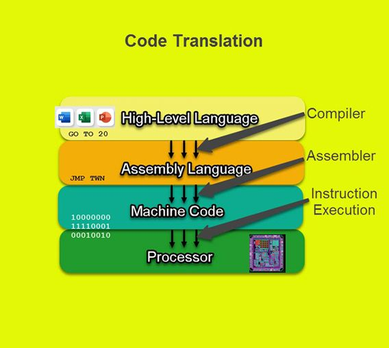
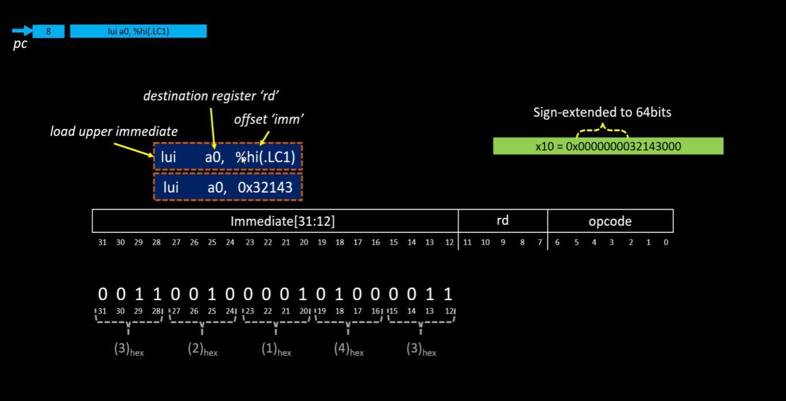
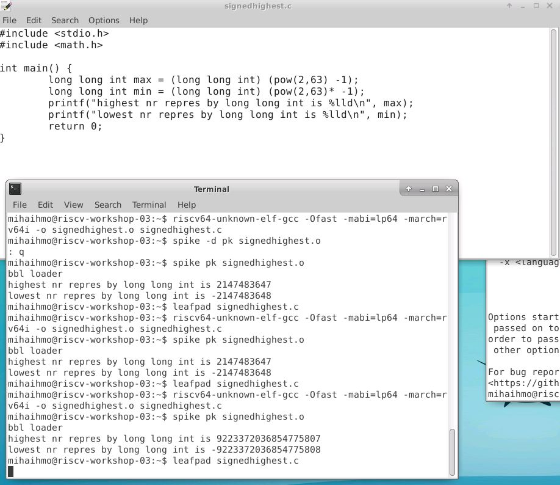

# RISC-V-workshop
2-6 Nov 2022 RISC-V based MYTH

Repository for workshop day 3-5 : https://github.com/stevehoover/RISC-V_MYTH_Workshop

## Table of Contents

  * [Day 1 - Introduction to RISC-V ISA and GNU compiler toolchain](# Day 1 - Introduction to RISC-V ISA and GNU compiler toolchain
    + [xxx](#)
  * [Day 2 - ABI and basic verification flow](# ## Day_2_-_ABI_and_basic_verification_flow
)
  
## Day 1 - Introduction to RISC-V ISA and GNU compiler toolchain

https://www.microcontrollertips.com/compilers-translators-interpreters-assemblers-faq/

There are several type of instruction:
- Pseudo instr (mv, li, ret) , operates 
- Base integer instruction (RV64I)( lui, addi)
- Multiply extension (RV64M) (mulw, divw)
- Floating (0sinlg, double) point extension (RV64F, RV64D) (flw, faad.s)

Other elements of instruction set is :
- Application binary interface (ABI) - this are some registers 
- Memory allocation and stack pointer

LAB:

riscv64-unknown-elf-gcc -O1 -mabi=lp64 -march=rv64i -o sum1ton.o sum1ton.c - used for compilation 
riscv64-unknown-elf-objdump -d sum1ton.o -used for disassemble
-d disassemble
-Ofast - we see less intructions in main
-O1 

addreses are incrementing by 4 .

Debug:
Spike pk - debugger for risc-v compile program

lui - loads the upper Immediate of the register

Number system: 8 bit is byte, 32 bit a word, 64 bit double word
For negative number use the 2's complement (invert binary pos value and add "+1") 
For pos numbers MSB is "0" and for neg MSB is "1".

|data type| Memory (bytes) | Format Specifier| Value range |
|---|---|---|---|
|unsigned int| 4 | %u| 0 - (2^32)-1|
int| 4 | %d| -(2^31) - (2^31)-1|
unsigned long long int | 8 | %llu|0 - (2^64)-1 |
long long int | 8 | %lld |  -(2^63) - (2^63)-1|

LAB:

## Day 2 - ABI and basic verification flow

Application binary interface: 
Different interfaces will be required in between different layers.

ISA - is accessible to user and OS and is requested from application via system calls - here is ABI.
ABI access the HW via registers, 32 Reg with 32 or 64 length (XLEN)

