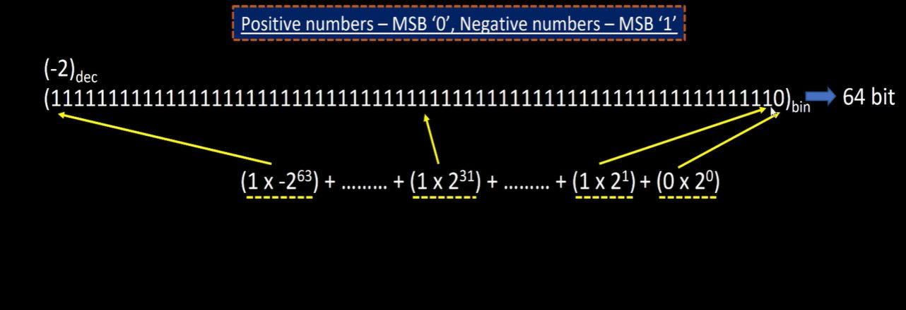

# RISC-V-workshop
2-6 Nov 2022 RISC-V based MYTH

Repository for workshop day 3-5 : https://github.com/stevehoover/RISC-V_MYTH_Workshop

## Table of Contents

  * [Day 1 - Introduction to RISC-V ISA and GNU compiler toolchain](# Day 1 - Introduction to RISC-V ISA and GNU compiler toolchain
    + [xxx](#)
  * [Day 2 - ABI and basic verification flow](# ## Day_2_-_ABI_and_basic_verification_flow
)
  
## Day 1 - Introduction to RISC-V ISA and GNU compiler toolchain

Building the enviromernt on the PC:
https://github.com/kunalg123/riscv_workshop_collaterals/blob/master/run.sh
```
sudo apt-get install git vim -y
sudo apt-get install autoconf automake autotools-dev curl libmpc-dev         libmpfr-dev libgmp-dev gawk build-essential bison flex texinfo     gperf libtool patchutils bc zlib1g-dev git libexpat1-dev gtkwave -y
cd
pwd=$PWD
mkdir riscv_toolchain
```


https://www.microcontrollertips.com/compilers-translators-interpreters-assemblers-faq/

There are several type of instruction:
- Pseudo instr (mv, li, ret) , operates 
- Base integer instruction (RV64I)( lui, addi)
- Multiply extension (RV64M) (mulw, divw)
- Floating (0sinlg, double) point extension (RV64F, RV64D) (flw, faad.s)

Other elements of instruction set is :
- Application binary interface (ABI) - this are some registers 
- Memory allocation and stack pointer

All the instructions in risc-v are 32 bit (64bit is the register size for RV64)

LAB:

riscv64-unknown-elf-gcc -O1 -mabi=lp64 -march=rv64i -o sum1ton.o sum1ton.c - used for compilation 
riscv64-unknown-elf-objdump -d sum1ton.o -used for disassemble
-d disassemble
-Ofast - we see less intructions in main
-O1 

addreses are incrementing by 4 .

Debug:
Spike pk - debugger for risc-v compile program


lui - loads the upper Immediate of the register

Number system: 8 bit is byte, 32 bit a word, 64 bit double word
For negative number use the 2's complement (invert binary pos value and add "+1") 
For pos numbers MSB is "0" and for neg MSB is "1".




|data type| Memory (bytes) | Format Specifier| Value range |
|---|---|---|---|
|unsigned int| 4 | %u| 0 - (2^32)-1|
int| 4 | %d| -(2^31) - (2^31)-1|
unsigned long long int | 8 | %llu|0 - (2^64)-1 |
long long int | 8 | %lld |  -(2^63) - (2^63)-1|

LAB:


## Day 2 - ABI and basic verification flow

Application binary interface: 
Different interfaces will be required in between different layers.


ISA - is accessible to user and OS and is requested from application via system calls - here is ABI.
ABI access the HW via registers, 32 Reg with 32 or 64 length (XLEN)

Memory usage and base inetger instruction (RV64I):


Name of ABI registers :


Lab: 
- Algo from sun1 to N, write the C and assamble variant .
- simulating RiscV procesor ,  and loading the the hex file thgourh the test becnh 


We used the eaxmple of files from :
https://github.com/kunalg123/riscv_workshop_collaterals.git/

The script rv32im.h will run all steps , can be studied to understand the steps:
```
include/boost-0   -c ../fesvr/htif.cc
^CMakefile:349: recipe for target 'htif.o' failed
make: *** [htif.o] Interrupt
mihaihmo@riscv-workshop-03:~/riscv_workshop_collaterals$ cd labs/
mihaihmo@riscv-workshop-03:~/riscv_workshop_collaterals/labs$ cat rv32im.sh 
riscv64-unknown-elf-gcc -c -mabi=ilp32 -march=rv32im -o 1to9_custom.o 1to9_custom.c 
riscv64-unknown-elf-gcc -c -mabi=ilp32 -march=rv32im -o load.o load.S

riscv64-unknown-elf-gcc -c -mabi=ilp32 -march=rv32im -o syscalls.o syscalls.c
riscv64-unknown-elf-gcc -mabi=ilp32 -march=rv32im -Wl,--gc-sections -o firmware.elf load.o 1to9_custom.o syscalls.o -T riscv.ld -lstdc++
chmod -x firmware.elf
riscv64-unknown-elf-gcc -mabi=ilp32 -march=rv32im -nostdlib -o start.elf start.S -T start.ld -lstdc++
chmod -x start.elf
riscv64-unknown-elf-objcopy -O verilog start.elf start.tmp
riscv64-unknown-elf-objcopy -O verilog firmware.elf firmware.tmp
cat start.tmp firmware.tmp > firmware.hex
python3 hex8tohex32.py firmware.hex > firmware32.hex
rm -f start.tmp firmware.tmp
iverilog -o testbench.vvp testbench.v picorv32.v
chmod -x testbench.vvp
vvp -N testbench.vvp
```

# Acknowledgements
- [Steve Hoover](https://github.com/stevehoover/RISC-V_MYTH_Workshop)
- [Kunal Ghosh](https://github.com/kunalg123)
- [VSD-IAT](https://vsdiat.com/)

# Useful Links:
- https://github.com/os-fpga/Virtual-FPGA-Lab
- https://github.com/shariethernet/RPHAX
- https://github.com/TL-X-org
- https://www.redwoodeda.com/
- https://www.tl-x.org/
- https://www.youtube.com/watch?time_continue=153&v=EeHK3Jbgv2s&feature=emb_logo
