# RISC-V_MYTH_Workshop

For students of "Microprocessor for You in Thirty Hours" Workshop, offered by for VLSI System Design (VSD) and Redwood EDA, find here accompanying live info and links.

Refer to README at [stevehoover/RISC-V_MYTH_Workshop](https://github.com/stevehoover/RISC-V_MYTH_Workshop) for lab instructions.

Add your codes in the [calculator_solutions.tlv](calculator_solutions.tlv) and [risc-v_solutions.tlv](risc-v_solutions.tlv) files and **keep committing** to your repository after every lab.

# Table of content:


|Lab referece|Sanbox Link|
|---|---|
Operations Mux 1:4| https://makerchip.com/sandbox/0PNf4hZrx/0vghEW0 | 
Fibonacci calc	| https://makerchip.com/sandbox/0PNf4hZrx/0qjh1O9 | 
Pipeline	| https://makerchip.com/sandbox/0PNf4hZrx/0wjhvLO# | 
Calc and counetr pipiline	| https://makerchip.com/sandbox/0PNf4hZrx/0xGhLJr |
simple calc and count	| https://makerchip.com/sandbox/0PNf4hZrx/0vghEW0# |
Validity	| https://makerchip.com/sandbox/0PNf4hZrx/0k5hkk5 |
Mem and recall	| https://myth3.makerchip.com/sandbox/02kfkh0Mk/0oYhDD6 |
RISC-V CPU | https://myth3.makerchip.com/sandbox/02kfkh0Mk/0LghkN1# |


## Day 3
### Hierarchy :
- used for reapeting a module  or library 
- " Lexical re-enrtance" -  used to jump between diferent context  

## Day 4 - Basic RISC-V microarchitecture
Basic elements:
- program counter - pointer into instruction memory , instructions that we need to next step 
- Instruction memory 
- Decoder - will interpret the instruction selected by PC ( with all elements intsr , register, immediate values) 
- Registers (source, destination) , must be ast least 2 port read register file (because we need min 2 source reg), 1 write register fiel
- ALU - performing the arithmetic 
- Data memory for data ( for store and load instructions )

Lab: https://raw.githubusercontent.com/stevehoover/RISC-V_MYTH_Workshop/ecba3769fff373ef6b8f66b3347e8940c859792d/tlv_lib/risc-v_shell_lib.tlv

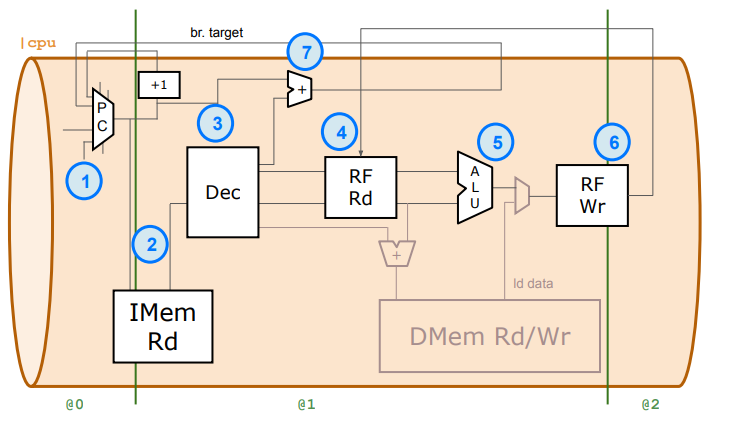

The starting code makerchip sandbox contains a std infrastructure for TLV with some macro definitions .  Some elements are "m4" - is a macro preprocesor use to define a asambler . So you can insert test programs. 
 ``` *passed = *cyc_cnt > 40; ``` and ```   *failed = 1'b0;``` used to setup the numbers of clocks and a pass message
- there are some macros that are instantiating some elements (Instr mem, register file , data mem) :
  - //m4+imem(@1)    // Args: (read stage)  --  the asm code is loaded here 
  - //m4+rf(@1, @1)  // Args: (read stage, write stage) - if equal, no register bypass is required
  - //m4+dmem(@4)    // Args: (read/write stage)
Useful tips: 
- if mouse is hovered over the diagram elements it willl so the expressions
- in wave form diagram is a section with elements for visualization window 

### PC:
- Reset of the PC must be done based on previous "reset" of the previous instruction. if the previous instruction was a reset the current instruction should use 0, to include the first non reset instruction in the pipeline.
The incrementation must be done with 4 , because of the instructions are 32 bit so we need 4 memory locations.
- Fetch : we need to connect the IMem to the PC by ```$inem_rd_addr[M4_IMEN_INDEX_CNT-1:0]``` (wich is needs PC/4 values) , the data will come out from ```$inem_rd_data``` conencted to a Decoder input ```$instr[31:0]``` . The read from mem has also a n enable signal.
  based on memory size PC range must be define.

### Decode Logic :
Instr[1:0] are always zero  

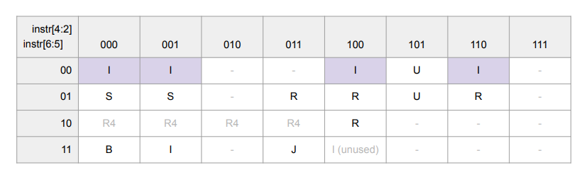

- Instruction type : To implement the set of instruction we use commands that check values with don't care values: ``` $is_i_instr = $ instr[6:2] ==? 5'b0000x || ...

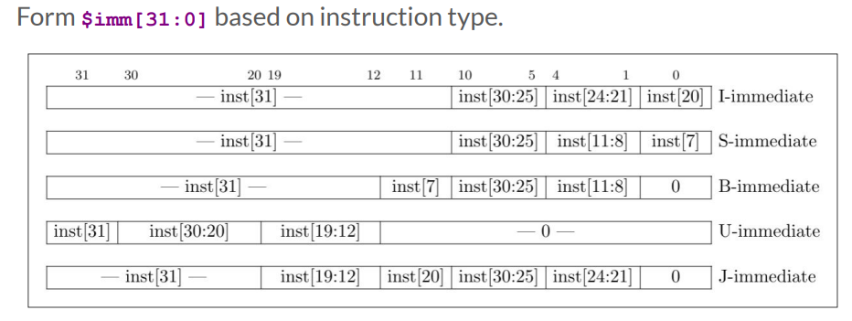

- Immediate value : it is 32 bita nd depends on the instruction type. This is formed by multiple 
Concatenation in TLV: ``{ {21{$instr[31]}}, $instr[30:20]}``` - final vector is formed by 21 copies of instr[31] bit + instr[30:20] . 
- The rest of instruction fields have fixed position independent of he type:
  
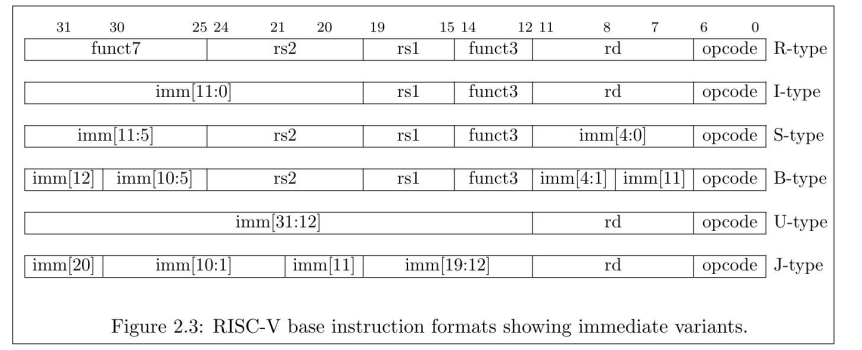

- Decode particular instructions for used instructions:

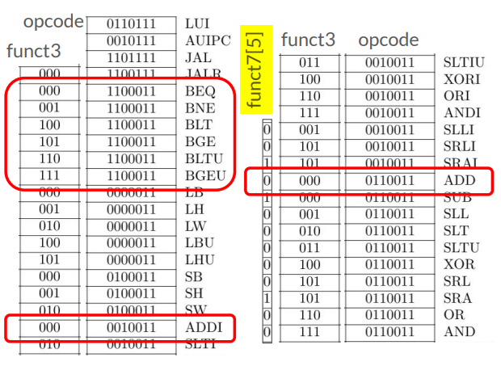

### Register file and ALU:
Register file is implemented as a macro ready done, capable for 2-read and 1-write. 

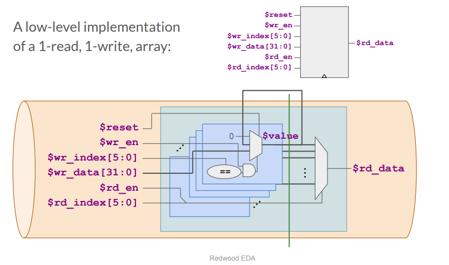 

The array contains a box for each value/entry with an index .
For write : if the ```$wr_index``` , during ```$wr_en``` is equal to the "entry number"  , selected data from ```$wr_data[]``` is the new ```$value captured inside the flipflops
For read : based on the ```$rd_index[]```, while ```$wr_en```, the mux will select the index /entry number that will be routed at the output ```$rd_data```.
Because ethe cpus usually read the values written on a previous instruction the concept is split in 2 clock stages.

- First we need to hook the read signals : ```rf_rd_enablex``` to ```rsx_valid``` , to enable the read and ```rsx``` fields to RF index ```rf_rd_index```. 
- connect the read values to ALU , implement the ALU intruction set, and connect the output of the ALU to RF write signals
- the read usually is done for values written a previous step . 

```
$result[31:0] = $is_addi ? $src1_value + $imm :
                         $is_add ? $src1_value + $src2_value :
                         $is_sub ? $src1_value - $src2_value :
                         $is_sll ? $src1_value << $src2_value[4:0] :
                         $is_srl ? $src1_value >> $src2_value[4:0] :
                         $is_sltu ? $sltu_rslt :
                         $is_sltiu ? $sltu_rslt :
                         $is_slt ? ($src1_value[31] == $src2_value[31]) ? $sltu_rslt : {31'b0, $src1_value[31]} :
                         $is_slti ? ($src1_value[31] == $imm[31]) ? $sltiu_rslt : {31'b0, $src1_value[31]} : 
                         $is_xor ? $src1_value ^ $src2_value :
                         $is_sra ? { {32{$src1_value[31]}}, $src1_value} >> $imm[4:0] :
                         $is_srai ? { {32{$src1_value[31]}}, $src1_value} >> $src2_value[4:0] :
                         $is_or ? $src1_value | $src2_value :
                         $is_and ? $src1_value & $src2_value :
                         $is_xori ? $src1_value ^ $imm :
                         $is_ori ? $src1_value | $imm :
                         $is_andi ? $src1_value & $imm :
                         $is_slli ? $src1_value << $imm[5:0] :
                         $is_srli ? $src1_value >> $imm[5:0] :
                         $is_lui ? {$imm[31:12], 12'b0} :
                         $is_auipc ? $pc + $imm :
                         ($is_load || $is_s_instr) ? $src1_value + $imm :  
                         32'bx;
```

### Branches
- Compute when a branch (instructions "bxxx") is needed, and where to branch ( PC of the branch and the immediate value of the instr). 
The branch target PC value will update the PC when previous instrction is a branch instruction (signal ```$taken_br``` will triger this).  

Final test example:  ```*passed = |cpu/xreg[10]>>5$value == (1+2+3+4+5+6+7+8+9);``` - testbench will monitor the value from ```/xreg[10]``` from RF . The name of the value from that register is ```$value```. ```>>5``` used to log more waveforms after the result is done , not to stop suddenly. When value will be equal with proper sum the simulation will stop.
  
## Day 5 - Pipelined RISC-V CPU
TLV is making the soultion easier compare to verilog.
Uasually this is needed when we want to speed up the logic , so we split up in more stages, so we run less logic in one cycle.
To understandthe pipelining is usefull to look at the design in a waterfall represenation  . 

 s 

We need to understand how each intruction logic is seeing the previuous stage logic . the top logic is the logic seen by the "first" instr  and the "second" instr is seeing bottom logic. The loopback connections between stages are represented here as with separate dobled logic that feeds output of the "first" instruction to the "second" instruction.
The structure can generate some dependencies problems, ex: the branch target needed is know 2 cycles later , RF Write data is know 1 cycle later for next RF Read. This are called "hazards".

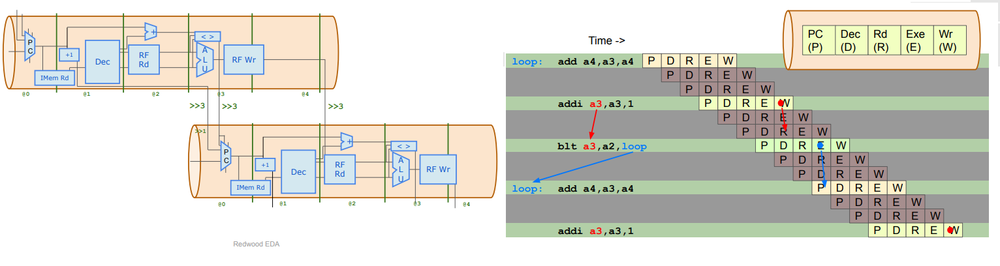

A solution to this problem is to compute each step evrey x clock cycles. For this a "valid" signal is need with "x" cyles cadance - done before with a conter - and can be coded with the ```>>x``` .
A good practice is to initialize teh cpu so a ```$start``` signal is required , imediate cyles after reset deasserts. This will generate also the first ```$valid```.  
```
$valid = $reset ? '0 : 
         $start ? '1 :
         >>3$valid;
```


Next we need to manage the invalid cyles .Not writing RF and PC on invalid cycles.
1. Avoid writing RF for invalid instructions. 
``` 
$rf_wr_en = ($rd == '0) ? '0 : ($rd_valid && $valid);
```
2. Avoid redirecting PC for invalid (branch) instructions. Introduce: ```$valid_taken_br = $valid && $taken_br;``` and use it in PC mux.
```
$pc[31:0] = >>1$reset ? '0 :
            >>3$valid_taken_br ? >>3$br_tgt_pc[31:0] :
           (>>3$pc[31:0] + 32'd4);
```
3. Update inter-instruction dependecny alligments (>>3)

### Solutions to Pipeline Hazards
We need solutions to run back to back instructions and get etter perfomance.
First the register file depences - issue exampled is that we do not have time write in the previous intruction and read in the same inrtuction (read after write hazard).
In the example is possible to bypass the ALU result from previous intr to curent intsr ALU input.  

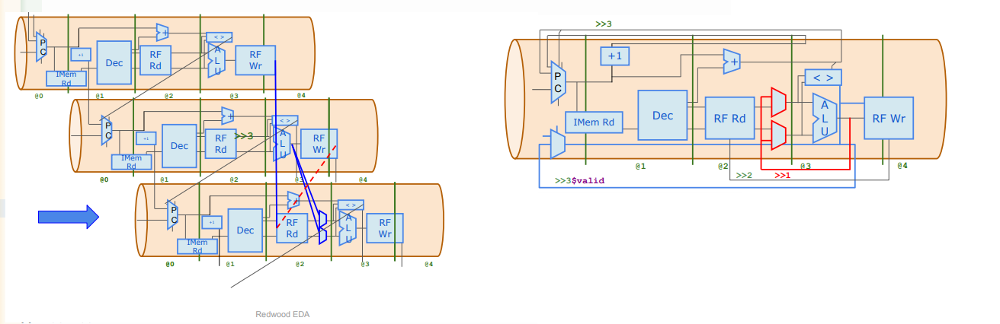 

1. RF read uses RF as written 2 instructions ago (already correct).
2. Update expressions for $srcX_value to select previous $result if it was written
to RF (write enable for RF) and if previous $rd == $rsX.

```
$src1_value[31:0] = (>>1$rf_wr_en && (>>1$rd == $rs1)) ? >>1$result : $rf_rd_data1;
$src2_value[31:0] = (>>1$rf_wr_en && (>>1$rd == $rs2)) ? >>1$result : $rf_rd_data2;
```
(Should have no effect yet)

Branch target path hazard :

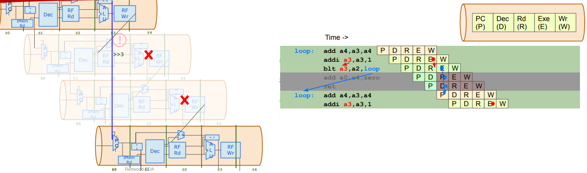

We need to addrase the 2 cylce paths and to "loose" them. 

1. Replace @1 $valid assignment with @3 $valid assignment based on the
non-existence of a valid $taken_br’s in previous two instructions.
```
@3
   $valid = !>>1$taken_br || !>>2$taken_br;
```
2. Increment PC every cycle (not every 3 cycles)
```
$pc[31:0] = >>1$reset ? '0 :
                     >>3$valid_taken_br ? >>3$br_tgt_pc[31:0] :
                     >>1$inc_pc;
```
3. (PC redirect for branches is already 3-cycle. No change.)

### Load/ store instructions

 |Load(LW, LH, LB, LHU, LBU) |Store (SW, SH, SB)|
 |--- |--- |
 |LOAD rd, imm(rs1)| STORE rs2, imm(rs1) |
 |rd <=DMem[addr] | DMem[addr]<==rs2 |
  
 where addr<=rs1+imm
 
- we will support the load /store instr just for word data.
- Load data is stored in the ```rd``` register  , and the address for the load is specified relative to a register ```rs1``` with ```imm``` ofset.
  In SW, ```rs1``` is can be pointer to amn object and ```imm``` is an element of the object 
- Stores in the memory the value of ```rs2``` at ```rs1 + imm``` address

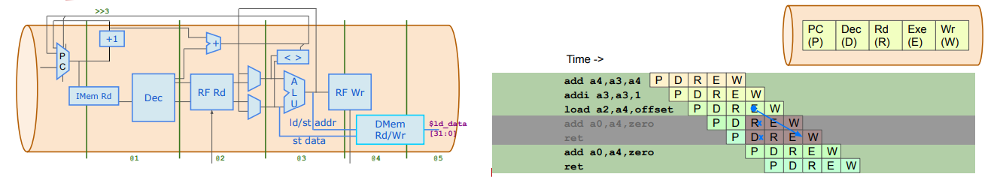

1. Clear $valid in the “shadow” of a load (like branch).
```
@3
$valid_load = $valid && $is_load;
```
2. Select $inc_pc from 3 instructions ago for load redirect
```
$pc[31:0] = >>1$reset ? '0 :
             >>3$valid_taken_br ? >>3$br_tgt_pc[31:0] :
             >>3$valid_load ? >>3$inc_pc :
             >>1$inc_pc;
```

Load data
1. For loads/stores ($is_load/$is_s_instr), compute same result as for addi.
```
$result[31:0] = $is_load ? $src1_value + $imm :
                $is_S_instr ? $src1_value + $imm :
                ...
```
2. Add the RF-wr-data MUX to select >>2$ld_data and >>2$rd as RF inputs for !
$valid instructions.
3. Enable write of $ld_data 2 instructions after valid $load.
```
$rf_wr_en = ($rd!=5'b0 && $rd_valid && $valid) || >>2$valid_load;
$rf_wr_index[4:0] = >>2$valid_load ? >>2$rd[4:0] : $rd[4:0];
$rf_wr_data[31:0] = >>2$valid_load ? >>2$ld_data : $result; 
 ```
4. Add the Data Memory 

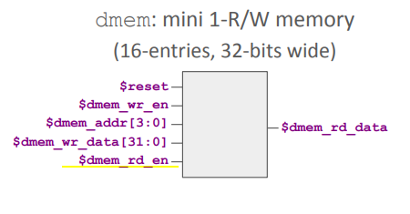

```
@3
$rf_wr_data[31:0] = >>2$valid_load ? >>2$dmem_rd_data : $result; 

@4
$dmem_wr_en = $valid && $is_s_instr;
$dmem_addr[3:0] =  $result[5:2];
$dmem_wr_data[31:0] = $src2_value;
$dmem_rd_en = $valid_load ;

```
### Jumps - Uncoditional branches 

JAL: Jump to PC +IMM
JALR : Jump to SRC1 + IMM

1. Define $is_jump (JAL or JALR), and, like $taken_br, create invalid cycles.
``` 
@3
  $valid = !>>1$valid_taken_br || !>>2$valid_taken_br || !>>1$valid_load || !>>2$valid_load || !>>1$valid_jump || !>>2$valid_jump;

  // Jump decode
  $is_jump = $is_jal || $is_jalr ;
  $valid_jump = $valid && $is_jump;
```
3. Compute $jalr_tgt_pc (SRC1 + IMM).
```
         $jalr_tgt_pc[31:0] = $src1_value + $imm ; 
```
4. Select correct $pc for JAL (>>3$br_tgt_pc) and JALR (>>3$jalr_tgt_pc)
```
$pc[31:0] = >>1$reset ? '0 :
            >>3$valid_taken_br ? >>3$br_tgt_pc[31:0] :
            >>3$valid_load ? >>3$inc_pc :
            >>3$valid_jump && >>3$is_jal ?  >>3$br_tgt_pc :
            >>3$valid_jump && >>3$is_jalr ?  >>3$jalr_tgt_pc :
            >>1$inc_pc;
```


# Acknowledgements
- [Steve Hoover](https://github.com/stevehoover/RISC-V_MYTH_Workshop)
- [Kunal Ghosh](https://github.com/kunalg123)
- [VSD-IAT](https://vsdiat.com/)
